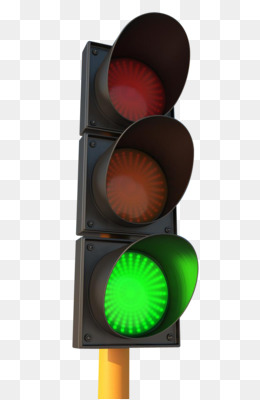

<h1 align="center">
    #Semaforo com Javacript
</h1>

<h2 align="center">
    
</h2>

---

## ✔ Sobre
Semaforo simples, feito durante as aulas de Javascript.

## ✔ Tecnologias Usadas
Nesse pequeno exercício pude aprender como utilizar o método:

- **setInterval()** -- Neste exercício, usado para determinar de quanto em quanto tempo, a função será executada. 

